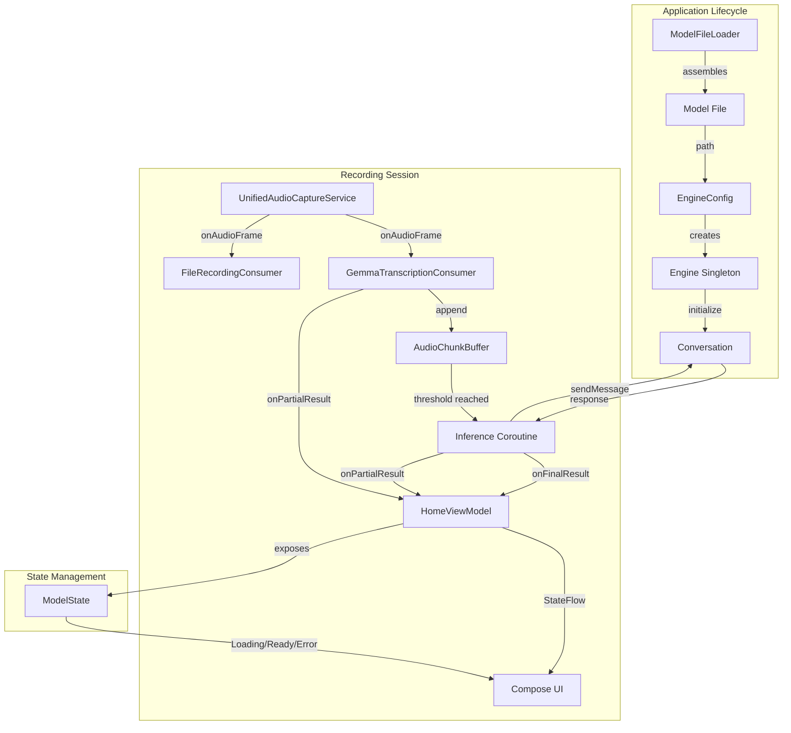
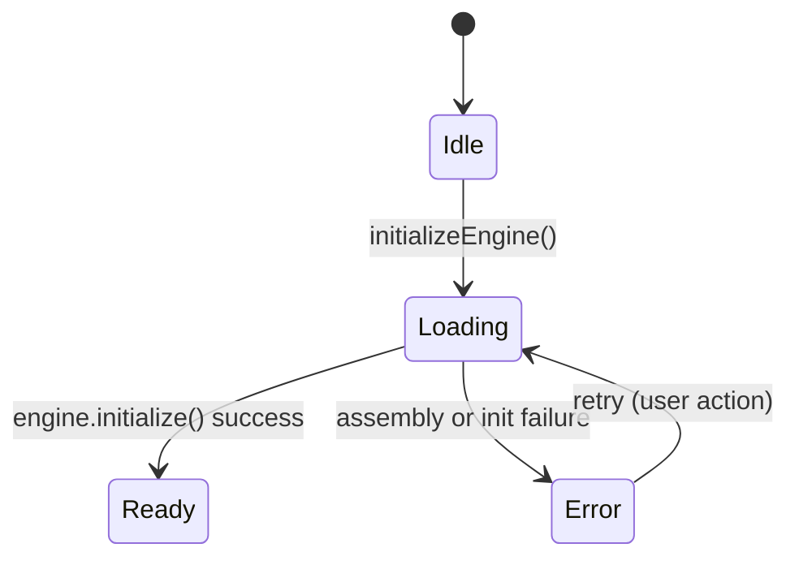
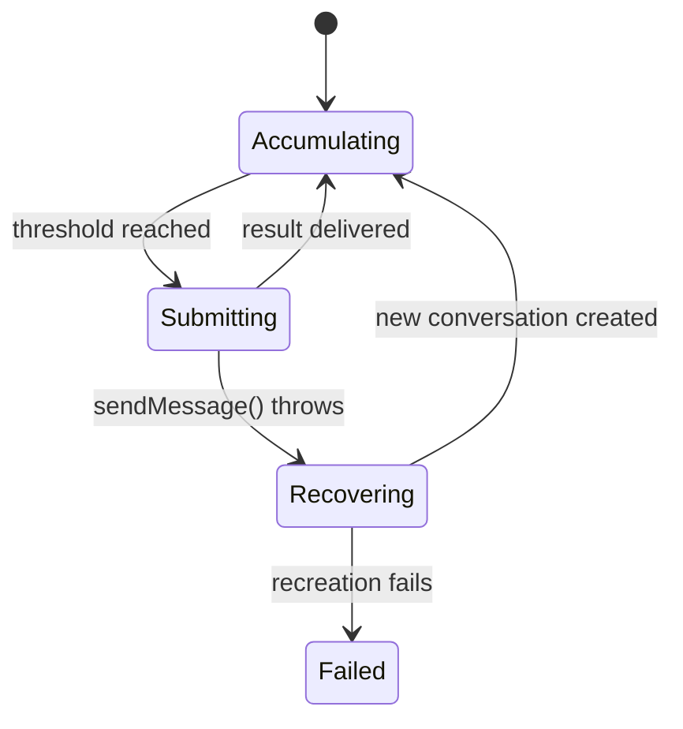

# Design Document: Gemma 4 On-Device Transcription

## Overview

This feature replaces the cloud-based `SpeechRecognitionConsumer` with a new `GemmaTranscriptionConsumer` that performs on-device speech-to-text using the Gemma 4 E2B model via the LiteRT-LM library. The design preserves the existing `AudioConsumer` fan-out architecture, introducing a new consumer that buffers raw PCM frames into time-based chunks and submits them to a locally-running LLM for transcription inference.

The key architectural change is moving from a no-op `onAudioFrame()` (the old `SpeechRecognitionConsumer` used Android's internal audio pipeline) to an active consumer that processes every PCM frame dispatched by `UnifiedAudioCaptureService`.

### Design Decisions

1. **Singleton Engine at Application scope** — The LiteRT-LM `Engine` is expensive to initialize (~2-4 seconds + memory). A singleton scoped to `Application` avoids re-loading the model between recording sessions.

2. **Ring buffer with atomic swap** — The audio buffer uses a lock-free append path for the capture thread and a mutex-guarded drain for the inference coroutine, ensuring the capture thread is never blocked.

3. **Chunk-based inference** — Rather than streaming token-by-token, audio is accumulated into 3-second chunks (configurable 2-5s) before submission. This matches Gemma 4 E2B's batch inference model and balances latency vs. quality.

4. **Conversation reuse with recovery** — A single `Conversation` is reused across chunks within a session. If it becomes invalid, the consumer attempts one recreation before giving up for the session.

5. **Backend.CPU()** — Chosen for maximum device compatibility over GPU/NPU backends that may not be available on all target devices (min SDK 26).

## Architecture



### Data Flow

1. **Startup**: `HomeViewModel` triggers `ModelFileLoader.loadModel()` on `Dispatchers.IO` → assembles model → initializes `Engine` singleton → creates `Conversation` → `ModelState.Ready`
2. **Recording**: User presses Start → `GemmaTranscriptionConsumer` + `FileRecordingConsumer` registered → capture begins
3. **Frame processing**: `onAudioFrame()` appends to `AudioChunkBuffer` (non-blocking) → when threshold reached, buffer is drained and submitted to inference coroutine
4. **Inference**: Coroutine calls `conversation.sendMessage(prompt)` on `Dispatchers.IO` → result delivered via `onFinalResult` callback → `HomeViewModel` creates `TranscriptSegment`
5. **Stop**: `release()` flushes remaining buffer, closes resources

## Components and Interfaces

### GemmaTranscriptionConsumer

The primary new component implementing `AudioConsumer`.

```kotlin
class GemmaTranscriptionConsumer(
    private val engine: GemmaEngineWrapper,
    private val onPartialResult: (text: String) -> Unit,
    private val onFinalResult: (text: String) -> Unit,
    private val onError: (message: String) -> Unit,
    private val chunkDurationSeconds: Float = 3.0f,
    private val coroutineScope: CoroutineScope
) : AudioConsumer {

    override fun prepare(sampleRate: Int, channelCount: Int, encoding: Int)
    override fun onAudioFrame(frame: ShortArray, frameSize: Int)
    override fun release()
}
```

**Responsibilities:**
- Accumulates PCM frames into `AudioChunkBuffer`
- Monitors buffer duration against chunk threshold
- Triggers inference submission when threshold is reached
- Delivers partial/final results via callbacks
- Handles inference errors with conversation recovery

### GemmaEngineWrapper

Singleton wrapper around the LiteRT-LM `Engine` and `Conversation`.

```kotlin
class GemmaEngineWrapper private constructor(
    private val context: Context
) {
    sealed class InitState {
        object Uninitialized : InitState()
        object Initializing : InitState()
        object Ready : InitState()
        data class Failed(val reason: String) : InitState()
    }

    val initState: StateFlow<InitState>

    suspend fun initialize(): Result<Unit>
    suspend fun sendMessage(prompt: String): Result<String>
    fun createNewConversation(): Result<Unit>
    fun release()

    companion object {
        @Volatile private var instance: GemmaEngineWrapper? = null
        fun getInstance(context: Context): GemmaEngineWrapper
    }
}
```

**Responsibilities:**
- Manages `Engine` lifecycle as application-scoped singleton
- Wraps `sendMessage()` with error handling and `Result` return type
- Provides conversation recreation for recovery
- Thread-safe initialization with double-checked locking

### AudioChunkBuffer

Thread-safe bounded buffer for PCM audio accumulation.

```kotlin
class AudioChunkBuffer(
    private val sampleRate: Int,
    private val maxDurationSeconds: Float = 30.0f
) {
    fun append(frame: ShortArray, frameSize: Int)
    fun drain(): ShortArray?
    fun durationSeconds(): Float
    fun clear()
    fun isEmpty(): Boolean

    val sampleCount: Int
    val maxSamples: Int
}
```

**Responsibilities:**
- Accepts frames from the capture thread without blocking (lock-free append path)
- Enforces maximum buffer size (30 seconds = 1,323,000 samples at 44100 Hz)
- Drops oldest samples when capacity is exceeded
- Provides atomic drain operation for the inference coroutine
- Reports current accumulated duration for partial result feedback

**Thread Safety Strategy:**
- Uses `ReentrantLock` with short critical sections for append/drain
- `append()` acquires lock briefly to copy frame into internal array
- `drain()` acquires lock, swaps internal buffer with empty, releases lock
- Lock contention is minimal because append is fast (array copy) and drain is infrequent (every 3 seconds)

### ModelState

Observable state for the model lifecycle exposed to UI.

```kotlin
sealed class ModelState {
    object Idle : ModelState()
    object Loading : ModelState()
    object Ready : ModelState()
    data class Error(val message: String) : ModelState()
}
```

### Updated HomeViewModel

Changes to `HomeViewModel`:

```kotlin
// New state
private val _modelState = MutableStateFlow<ModelState>(ModelState.Idle)
val modelState: StateFlow<ModelState> = _modelState.asStateFlow()

// New initialization in init block
init {
    initializeEngine()
}

private fun initializeEngine() {
    _modelState.value = ModelState.Loading
    viewModelScope.launch(Dispatchers.IO) {
        // 1. Assemble model file
        // 2. Initialize engine
        // 3. Update state on Main
    }
}

// Modified startRecording() — replaces SpeechRecognitionConsumer with GemmaTranscriptionConsumer
fun startRecording() {
    if (_modelState.value != ModelState.Ready) {
        _error.value = "Transcription model is not ready"
        return
    }
    // ... create GemmaTranscriptionConsumer + FileRecordingConsumer
}
```

## Data Models

### Audio Processing

| Field | Type | Description |
|-------|------|-------------|
| `sampleRate` | `Int` | 44100 Hz (from `AudioConfig.SAMPLE_RATE`) |
| `channelCount` | `Int` | 1 (mono) |
| `bitsPerSample` | `Int` | 16 (PCM 16-bit) |
| `bytesPerSecond` | `Int` | 88,200 (44100 × 1 × 2) |
| `samplesPerSecond` | `Int` | 44,100 |
| `chunkDurationSeconds` | `Float` | 3.0 (configurable 2.0–5.0) |
| `chunkSampleCount` | `Int` | 132,300 (44100 × 3) |
| `maxBufferSamples` | `Int` | 1,323,000 (44100 × 30) |
| `maxBufferBytes` | `Int` | ~2.6 MB (1,323,000 × 2) |

### Transcription Prompt Format

The prompt sent to Gemma 4 E2B for transcription:

```
Transcribe the following audio. Output only the spoken words, no timestamps or labels.
[audio data encoded as base64 PCM]
```

> **Note:** The exact prompt format depends on how LiteRT-LM's `sendMessage()` accepts audio input. If the API supports direct audio byte arrays, we pass raw PCM. If it requires text-only prompts, we encode as base64. This will be determined during implementation based on the LiteRT-LM SDK documentation.

### State Transitions



### Inference State (internal to GemmaTranscriptionConsumer)



## Correctness Properties

*A property is a characteristic or behavior that should hold true across all valid executions of a system — essentially, a formal statement about what the system should do. Properties serve as the bridge between human-readable specifications and machine-verifiable correctness guarantees.*

### Property 1: Model Assembly Idempotence

*For any* assembled model file that already exists with non-zero size, calling `loadModel()` again SHALL return the same file path without modifying the file's contents or last-modified timestamp.

**Validates: Requirements 1.2**

### Property 2: Frame Accumulation Preserves Order

*For any* sequence of audio frames dispatched to `onAudioFrame()`, the internal buffer SHALL contain all samples in the exact order they were received, with no samples lost or reordered (up to the buffer capacity limit).

**Validates: Requirements 4.1**

### Property 3: Chunk Submission Triggers at Threshold

*For any* sequence of audio frames whose cumulative duration crosses the configured chunk threshold, the consumer SHALL trigger exactly one inference submission at the point where the threshold is first exceeded, and the submitted chunk SHALL contain exactly the samples accumulated up to that point.

**Validates: Requirements 4.2**

### Property 4: Non-Blocking Frame Acceptance

*For any* audio frame and any internal state of the consumer (including while inference is in progress), `onAudioFrame()` SHALL return without blocking the calling thread, and the frame SHALL be successfully buffered for future processing.

**Validates: Requirements 4.4, 5.3, 9.1**

### Property 5: Bounded Buffer with Oldest-Drop Policy

*For any* sequence of audio frames whose cumulative sample count exceeds the maximum buffer capacity (30 seconds × 44100 samples/sec = 1,323,000 samples), the buffer SHALL never contain more than `maxSamples` samples, and the retained samples SHALL be the most recently appended ones.

**Validates: Requirements 4.5, 8.3**

### Property 6: Non-Empty Inference Response Delivers Final Result

*For any* non-empty string returned by `conversation.sendMessage()`, the consumer SHALL invoke the `onFinalResult` callback exactly once with that string as the argument.

**Validates: Requirements 5.2**

### Property 7: Partial Result Reflects Accumulation Progress

*For any* sequence of audio frames being accumulated below the chunk threshold, the consumer SHALL invoke `onPartialResult` with a status string that reflects the current accumulation state (e.g., accumulated duration or "Listening...").

**Validates: Requirements 6.1**

### Property 8: Final Result Clears Partial Result

*For any* final transcription result delivered via `onFinalResult`, the consumer SHALL subsequently invoke `onPartialResult("")` to clear the partial result indicator.

**Validates: Requirements 6.3**

### Property 9: Error Resilience — Inference Failure Does Not Halt Processing

*For any* exception thrown by `sendMessage()` during inference, the consumer SHALL invoke `onError` with a descriptive message AND continue accepting and processing subsequent audio chunks (the consumer remains operational).

**Validates: Requirements 7.1**

### Property 10: Mutual Exclusion — Single Concurrent Inference

*For any* sequence of chunk submissions, at most one `sendMessage()` call SHALL be in progress at any given time. Subsequent chunks that become ready while inference is active SHALL be queued, not submitted concurrently.

**Validates: Requirements 9.4**

## Error Handling

### Error Categories

| Category | Source | Recovery Strategy |
|----------|--------|-------------------|
| Model Assembly I/O | `ModelFileLoader.loadModel()` | Transition to `ModelState.Error`, display message, allow retry |
| Engine Initialization | `engine.initialize()` | Transition to `ModelState.Error`, display message, allow retry |
| Inference Exception | `conversation.sendMessage()` | Log error, invoke `onError`, continue with next chunk |
| Conversation Invalid | Repeated `sendMessage()` failures | Attempt `createNewConversation()`, if fails → cease inference for session |
| Buffer Overflow | Frames exceed 30s capacity | Drop oldest samples, log warning (non-fatal) |
| Storage Insufficient | `< 10 MB` free before assembly | Block assembly, report error to user |

### Error Propagation

```
GemmaTranscriptionConsumer.onError → HomeViewModel._error → UI (Snackbar/Toast)
GemmaEngineWrapper.InitState.Failed → HomeViewModel._modelState → UI (Error state)
```

### Conversation Recovery Flow

```kotlin
// Pseudocode for inference with recovery
suspend fun performInference(audioChunk: ShortArray): Result<String> {
    val result = engine.sendMessage(buildPrompt(audioChunk))
    if (result.isFailure) {
        // Attempt conversation recovery
        val recovery = engine.createNewConversation()
        if (recovery.isSuccess) {
            return engine.sendMessage(buildPrompt(audioChunk))
        } else {
            // Terminal failure for this session
            onError("Transcription unavailable. Please restart recording.")
            cease inference
        }
    }
    return result
}
```

## Testing Strategy

### Property-Based Tests (Kotest)

The project already includes Kotest for property-based testing. Each correctness property maps to a single property-based test with minimum 100 iterations.

**Library:** `io.kotest:kotest-property:5.8.0` (already in `build.gradle.kts`)

**Test Configuration:**
- Minimum 100 iterations per property test
- Each test tagged with: `Feature: gemma4-android-transcription, Property {N}: {title}`
- Tests target pure logic components: `AudioChunkBuffer`, frame processing, state transitions

**Property test targets:**
| Property | Component Under Test | Generator Strategy |
|----------|---------------------|-------------------|
| 1 (Idempotence) | `ModelFileLoader` (with mock filesystem) | Random file sizes > 0 |
| 2 (Order preservation) | `AudioChunkBuffer.append()` | Random `ShortArray` sequences |
| 3 (Threshold trigger) | `GemmaTranscriptionConsumer` chunk logic | Random frame sequences crossing threshold |
| 4 (Non-blocking) | `AudioChunkBuffer.append()` | Random frames + concurrent drain |
| 5 (Bounded buffer) | `AudioChunkBuffer` | Frame sequences exceeding capacity |
| 6 (Final result delivery) | `GemmaTranscriptionConsumer` result handling | Random non-empty strings |
| 7 (Partial result) | `GemmaTranscriptionConsumer` accumulation | Random sub-threshold frame sequences |
| 8 (Clear partial) | `GemmaTranscriptionConsumer` result lifecycle | Random result strings |
| 9 (Error resilience) | `GemmaTranscriptionConsumer` error handling | Random exceptions + subsequent frames |
| 10 (Mutual exclusion) | `GemmaTranscriptionConsumer` inference scheduling | Rapid chunk submissions |

### Unit Tests (JUnit 4)

Example-based tests for specific scenarios:

- `ModelState` transitions (Loading → Ready, Loading → Error)
- `HomeViewModel.startRecording()` guard when model not ready
- `GemmaEngineWrapper` singleton behavior
- Conversation recovery flow (success and failure paths)
- `release()` resource cleanup verification
- Consumer registration (both Gemma + FileRecording)

### Integration Tests

- End-to-end flow: frame dispatch → buffer → mock inference → callback delivery
- `UnifiedAudioCaptureService` fan-out to both consumers (existing architecture)
- `HomeViewModel` session save with transcript + audio file path

### What Is NOT Property-Tested

- UI rendering and accessibility (Requirement 10) — verified via Compose UI tests and manual TalkBack testing
- Android framework interactions (AudioRecord, asset loading) — integration tests
- LiteRT-LM SDK behavior — mocked in property tests, verified in integration tests
- Threading dispatcher assignment — verified via example-based unit tests
