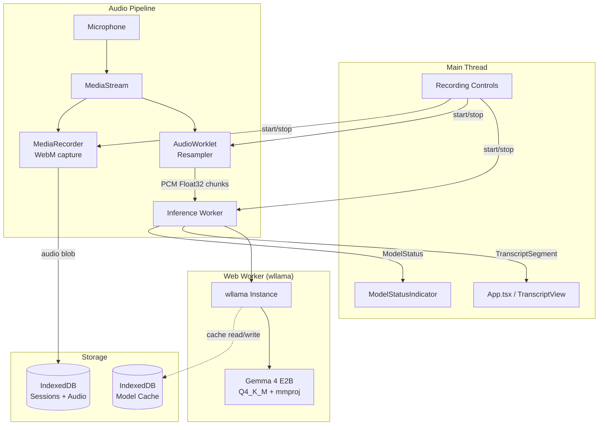

# Design Document: Gemma 4 Local Transcription

## Overview

This design replaces the Web Speech API transcription in the TranscribeCare web app with a fully local, privacy-preserving transcription pipeline powered by the Gemma 4 E2B model running via llama.cpp's WebAssembly build. The implementation uses the [wllama](https://github.com/ngxson/wllama) library — a production-ready WebAssembly binding for llama.cpp that provides in-browser inference with Web Worker isolation, SIMD acceleration, and model caching.

The Gemma 4 E2B model is Google's smallest fully-multimodal model (text + image + audio) available in GGUF format. It consists of two files: a main text tower (~2.1 GB at Q4_K_M quantization) and a multimodal projector (`mmproj-BF16.gguf`, ~940 MB) that contains both vision and audio encoders. For transcription, both files are required.

### Key Design Decisions

1. **wllama over raw llama.cpp WASM**: wllama provides a high-level TypeScript API, automatic Web Worker isolation, model splitting/parallel download, and progress callbacks — eliminating the need to build custom WASM bindings.

2. **IndexedDB for model caching**: Model weights are cached in IndexedDB (via wllama's built-in caching) to enable offline use after initial download. This aligns with the existing IndexedDB pattern used for session storage.

3. **AudioWorklet for preprocessing**: Audio is captured via the existing MediaRecorder flow and simultaneously processed through an AudioWorklet node that resamples to 16kHz mono PCM float32 — the format required by Gemma 4's audio encoder.

4. **Chunked inference**: Audio is processed in ~5-second chunks to provide incremental transcription results, balancing latency against inference quality.

## Architecture



### Data Flow

1. User clicks "Start Recording"
2. Main thread requests microphone access, creates MediaStream
3. MediaStream is routed to both:
   - **AudioWorklet** (resamples to 16kHz mono float32, buffers ~5s chunks)
   - **MediaRecorder** (captures WebM for playback, same as current implementation)
4. AudioWorklet posts PCM chunks to the inference Web Worker via MessagePort
5. Web Worker runs wllama inference on each chunk, producing text
6. Worker posts TranscriptSegment objects back to main thread
7. Main thread updates TranscriptView (same interface as current Web Speech API flow)

## Components and Interfaces

### 1. ModelLoader

Responsible for downloading, caching, and initializing the Gemma 4 model.

```typescript
/** Model loading states */
type ModelStatus = 'idle' | 'downloading' | 'initializing' | 'ready' | 'error';

interface ModelProgress {
  status: ModelStatus;
  /** Download progress 0-100, only meaningful during 'downloading' */
  downloadPercent: number;
  /** Human-readable error message when status is 'error' */
  errorMessage?: string;
}

interface ModelLoaderConfig {
  /** HuggingFace repo for the GGUF model */
  modelRepo: string;
  /** Filename of the main model GGUF (or first split) */
  modelFile: string;
  /** Filename of the multimodal projector */
  mmprojFile: string;
}

/**
 * Initializes wllama, downloads/caches model, and reports progress.
 * Runs inside the Web Worker.
 */
interface ModelLoader {
  initialize(config: ModelLoaderConfig): Promise<void>;
  getStatus(): ModelStatus;
  onProgress(callback: (progress: ModelProgress) => void): void;
  isModelCached(): Promise<boolean>;
}
```

### 2. AudioProcessor

Captures microphone audio and resamples it for the transcription engine.

```typescript
interface AudioProcessorConfig {
  /** Target sample rate for transcription (16000) */
  targetSampleRate: number;
  /** Chunk duration in seconds for incremental processing */
  chunkDurationSec: number;
}

interface AudioChunk {
  /** PCM float32 samples at targetSampleRate, mono */
  samples: Float32Array;
  /** Timestamp of chunk start relative to recording start (ms) */
  timestampMs: number;
}

/**
 * Manages the audio capture pipeline:
 * - MediaStream from getUserMedia
 * - AudioWorklet for resampling
 * - MediaRecorder for WebM capture
 */
interface AudioProcessor {
  start(): Promise<void>;
  stop(): Promise<{ audioBlob: Blob; chunks: AudioChunk[] }>;
  onChunk(callback: (chunk: AudioChunk) => void): void;
}
```

### 3. TranscriptionEngine

Orchestrates the inference pipeline, bridging audio input to transcript output.

```typescript
interface TranscriptSegment {
  id: string;
  text: string;
  type: 'past' | 'recent' | 'current';
}

interface TranscriptionEngineConfig {
  modelConfig: ModelLoaderConfig;
  audioConfig: AudioProcessorConfig;
}

/**
 * High-level API consumed by App.tsx.
 * Manages the full lifecycle: model loading → audio capture → inference → segments.
 */
interface TranscriptionEngine {
  /** Initialize model (download if needed, load from cache) */
  loadModel(): Promise<void>;

  /** Start a transcription session */
  startSession(): Promise<void>;

  /** Stop the current session, finalize remaining audio */
  stopSession(): Promise<{ audioBlob: Blob; segments: TranscriptSegment[] }>;

  /** Subscribe to interim/final transcript segments */
  onSegment(callback: (segment: TranscriptSegment) => void): void;

  /** Subscribe to model status changes */
  onModelStatus(callback: (progress: ModelProgress) => void): void;

  /** Current model status */
  getModelStatus(): ModelStatus;
}
```

### 4. AudioResamplerWorklet

An AudioWorkletProcessor that performs real-time resampling.

```typescript
/**
 * AudioWorkletProcessor that:
 * 1. Receives audio at the device's native sample rate (typically 44.1kHz or 48kHz)
 * 2. Resamples to 16kHz mono
 * 3. Buffers samples until a full chunk is ready
 * 4. Posts the chunk to the main thread via MessagePort
 */
// Registered as 'audio-resampler-worklet'
class AudioResamplerProcessor extends AudioWorkletProcessor {
  // Linear interpolation resampling
  // Accumulates samples into buffer
  // Posts Float32Array when buffer reaches chunkSize
}
```

### 5. InferenceWorker

The Web Worker that hosts the wllama instance and runs inference.

```typescript
/** Messages from main thread to worker */
type WorkerInMessage =
  | { type: 'init'; config: ModelLoaderConfig }
  | { type: 'transcribe'; chunk: AudioChunk }
  | { type: 'finalize' };

/** Messages from worker to main thread */
type WorkerOutMessage =
  | { type: 'model-progress'; progress: ModelProgress }
  | { type: 'transcript'; segment: TranscriptSegment }
  | { type: 'error'; message: string };
```

### 6. ModelStatusIndicator (UI Component)

Displays model loading state with accessibility support.

```typescript
interface ModelStatusIndicatorProps {
  status: ModelStatus;
  downloadPercent: number;
  errorMessage?: string;
  onRetry?: () => void;
}

/**
 * Renders model status with:
 * - Progress bar during download
 * - Spinner during initialization
 * - Success checkmark when ready
 * - Error message with retry button
 * - aria-live="polite" region for screen reader announcements
 */
function ModelStatusIndicator(props: ModelStatusIndicatorProps): JSX.Element;
```

## Data Models

### Model Files (stored in IndexedDB via wllama)

| File | Description | Size (Q4_K_M) |
|------|-------------|----------------|
| `google-gemma-4-E2B-it-Q4_K_M-00001-of-NNNNN.gguf` | Main text tower (split) | ~2.1 GB total |
| `mmproj-BF16.gguf` | Vision + audio projector | ~940 MB |

Total storage requirement: ~3 GB

### Audio Format Pipeline

| Stage | Format | Sample Rate | Channels |
|-------|--------|-------------|----------|
| Microphone input | Browser native | 44.1/48 kHz | Mono/Stereo |
| AudioWorklet output | PCM Float32 | 16 kHz | Mono |
| MediaRecorder output | WebM/Opus | Native | As captured |

### TranscriptSegment (unchanged from current)

```typescript
interface TranscriptSegment {
  id: string;       // Unique identifier (timestamp-based)
  text: string;     // Transcribed text content
  type: 'past' | 'recent' | 'current';  // Display classification
}
```

### ModelProgress (new)

```typescript
interface ModelProgress {
  status: ModelStatus;
  downloadPercent: number;
  errorMessage?: string;
}
```

### Worker Message Protocol

```typescript
// Transferred via postMessage between main thread and inference worker
interface AudioChunkTransfer {
  samples: Float32Array;  // Transferred (not copied) for performance
  timestampMs: number;
}
```


## Correctness Properties

*A property is a characteristic or behavior that should hold true across all valid executions of a system — essentially, a formal statement about what the system should do. Properties serve as the bridge between human-readable specifications and machine-verifiable correctness guarantees.*

### Property 1: Audio resampling produces correct output format

*For any* input audio buffer at any valid browser sample rate (8kHz–96kHz) with any number of channels (1 or 2), the AudioResamplerWorklet SHALL produce output that is mono (single channel), at exactly 16kHz sample rate, in Float32 format, and with a sample count equal to `inputSamples * (16000 / inputSampleRate)` (within ±1 sample for rounding).

**Validates: Requirements 2.2**

### Property 2: Chunk buffering preserves all audio samples

*For any* stream of audio samples of arbitrary total length, the chunking system SHALL produce chunks that are each exactly the configured chunk size (except the final chunk which may be smaller), and the concatenation of all chunk samples SHALL equal the original input samples in order.

**Validates: Requirements 2.3**

### Property 3: All submitted audio chunks are processed without loss

*For any* sequence of N audio chunks submitted to the TranscriptionEngine during an active session, all N chunks SHALL be processed by the inference pipeline (none dropped), and each chunk SHALL produce at least one TranscriptSegment emission.

**Validates: Requirements 3.3, 5.2**

### Property 4: Produced TranscriptSegments have valid structure

*For any* TranscriptSegment produced by the TranscriptionEngine, it SHALL have a non-empty string `id`, a non-empty string `text`, and a `type` field with value `'current'` — conforming to the TranscriptView component interface.

**Validates: Requirements 3.4, 4.1**

### Property 5: Session stop finalizes all buffered audio

*For any* amount of buffered audio remaining when `stopSession()` is called (where buffered audio length > 0), the TranscriptionEngine SHALL produce at least one final TranscriptSegment from the remaining buffer before completing the stop operation.

**Validates: Requirements 4.3**

## Error Handling

### Model Loading Errors

| Error Condition | Detection | User-Facing Response |
|----------------|-----------|---------------------|
| Network failure during download | wllama `progressCallback` error / fetch rejection | Display error message with retry button. Status → `'error'` |
| Storage quota exceeded | IndexedDB `QuotaExceededError` | Inform user of insufficient storage, suggest clearing browser data |
| Corrupt/incomplete cache | wllama load failure after cache hit | Clear cache entry, re-download model |
| WASM instantiation failure | wllama initialization rejection | Display "browser not supported" message |

### Audio Pipeline Errors

| Error Condition | Detection | User-Facing Response |
|----------------|-----------|---------------------|
| Microphone permission denied | `getUserMedia` rejection with `NotAllowedError` | Display accessible message explaining how to grant permission |
| No microphone available | `getUserMedia` rejection with `NotFoundError` | Display "no microphone detected" message |
| AudioWorklet not supported | Feature detection failure | Fall back to ScriptProcessorNode (deprecated but functional) |
| AudioContext suspended | Browser autoplay policy | Resume AudioContext on user gesture |

### Inference Errors

| Error Condition | Detection | User-Facing Response |
|----------------|-----------|---------------------|
| Out of memory (WASM) | wllama OOM error | Notify user of insufficient memory, suggest closing other tabs |
| Worker crash | Worker `onerror` event | Attempt worker restart; if repeated, show error and stop session |
| Inference timeout (>10s per chunk) | Timer in main thread | Skip chunk, continue with next; log warning |

### Recovery Strategy

- **Transient errors** (network glitch, single inference timeout): Automatic retry with exponential backoff (max 3 attempts)
- **Persistent errors** (OOM, unsupported browser): Surface to user with clear messaging and suggested actions
- **Session preservation**: If inference fails mid-session, the MediaRecorder continues capturing audio so the recording is never lost even if transcription fails

## Testing Strategy

### Unit Tests (Example-Based)

Unit tests cover specific scenarios, edge cases, and UI behavior:

- **ModelStatusIndicator rendering**: Verify correct UI for each status state (downloading, initializing, ready, error)
- **Button disable/enable**: Verify recording button is disabled when model is not ready
- **Error message display**: Verify correct error messages for permission denied, offline + no cache, OOM
- **Progress calculation**: Verify download percentage is computed correctly from loaded/total bytes
- **Session lifecycle**: Verify start → segments → stop → save sequence
- **Accessibility**: Verify aria-live region announces model ready state

### Property-Based Tests

Property-based tests verify universal correctness properties using [fast-check](https://github.com/dubzzz/fast-check) (the standard PBT library for TypeScript/JavaScript).

**Configuration:**
- Minimum 100 iterations per property test
- Each test tagged with: `Feature: gemma4-local-transcription, Property {N}: {title}`

**Properties to implement:**

1. **Audio resampling correctness** — Generate random Float32Arrays at various sample rates, verify output length and format invariants
2. **Chunk buffering preservation** — Generate random-length sample streams, verify chunk sizes and sample preservation
3. **Chunk processing completeness** — Generate random chunk sequences, verify all are processed via mock inference
4. **Segment structural validity** — Generate random inference outputs, verify all produced segments match the interface
5. **Stop finalization** — Generate random buffer states at stop time, verify final segment is always produced

### Integration Tests

Integration tests verify the wiring between components:

- Model download and cache round-trip (with mock network)
- Full audio pipeline: microphone → worklet → worker → segments (with mock wllama)
- Offline mode: cached model loads without network
- Dual output: AudioWorklet and MediaRecorder both receive data simultaneously
- Session save: audio blob + segments persisted to IndexedDB

### Test Infrastructure

- **fast-check** for property-based testing (npm package, integrates with Vitest)
- **Vitest** as test runner (aligns with Vite build tool)
- **Mock wllama**: Stub the wllama inference to return deterministic text for unit/property tests
- **Mock AudioContext**: Use `OfflineAudioContext` or stubs for AudioWorklet testing
- **Mock IndexedDB**: Use `fake-indexeddb` for cache testing without browser environment
