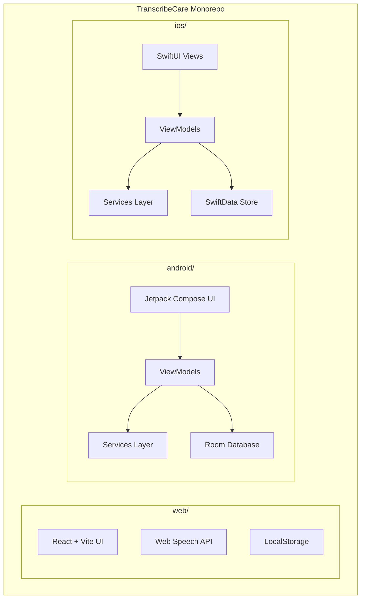
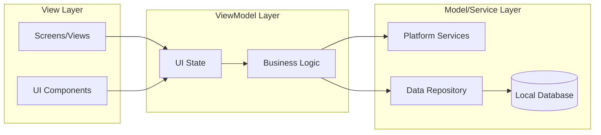
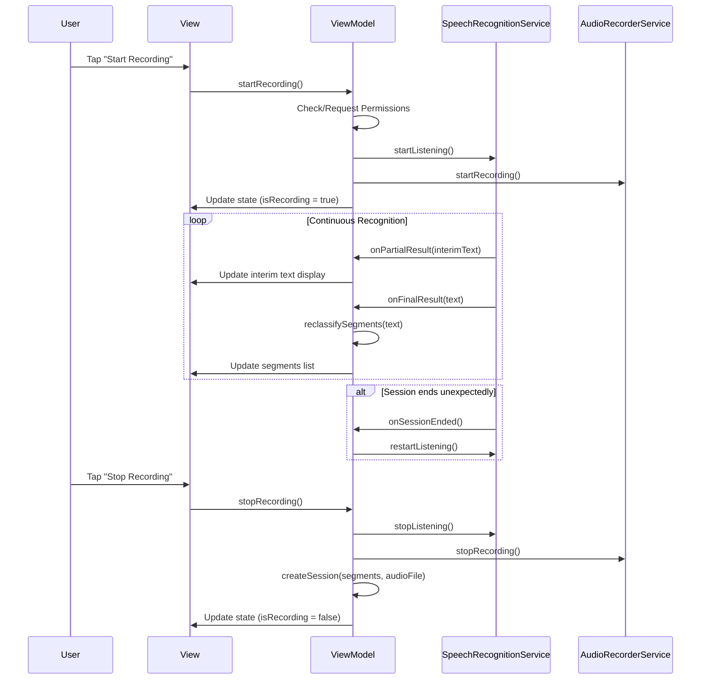
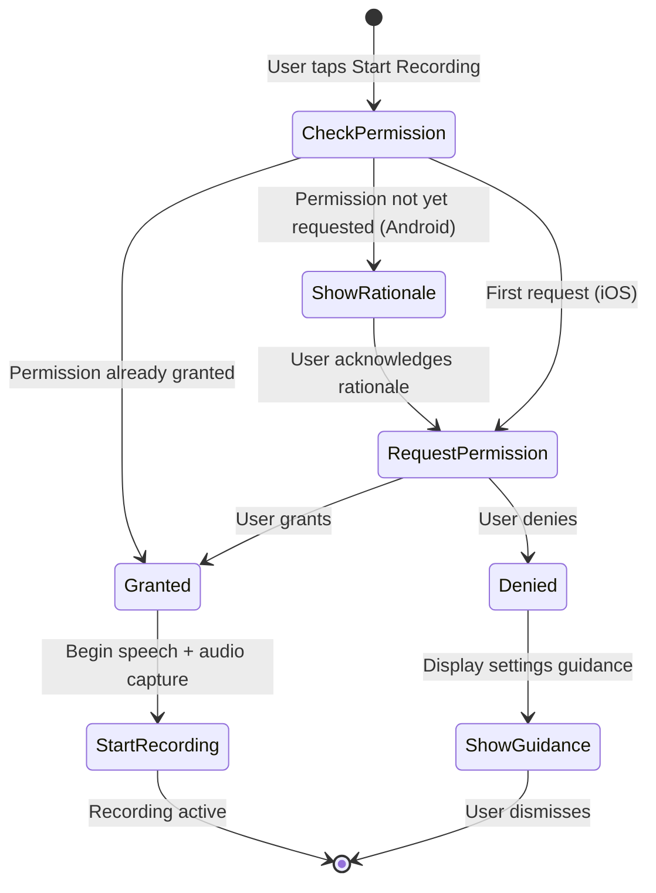

# Design Document: Monorepo Native Apps

## Overview

This design restructures the TranscribeCare project from a single web application into a monorepo containing three platform targets: the existing React/Vite web app, a native Android app (Kotlin + Jetpack Compose), and a native iOS app (Swift + SwiftUI). Each native app replicates the web app's core functionality — real-time speech-to-text transcription, audio recording with variable-speed playback, session history with search, family sharing, and accessibility features — using platform-native APIs for optimal performance and user experience.

The native apps follow MVVM architecture with clear separation between UI, business logic, and data layers. Both platforms share conceptually identical data models and feature parity, while leveraging platform-specific APIs (Android `SpeechRecognizer` / iOS `SFSpeechRecognizer`, Android `MediaRecorder` / iOS `AVAudioRecorder`, etc.).

## Architecture

### Monorepo Structure

```
transcribecare/
├── README.md                    # Root documentation with setup instructions
├── .gitignore                   # Combined gitignore for all platforms
├── web/                         # Existing React/Vite web application
│   ├── index.html
│   ├── package.json
│   ├── vite.config.ts
│   ├── tsconfig.json
│   ├── metadata.json
│   ├── .env.example
│   ├── README.md
│   └── src/
│       ├── main.tsx
│       ├── App.tsx
│       └── index.css
├── android/                     # Native Android application
│   ├── build.gradle.kts         # Root Gradle build file
│   ├── settings.gradle.kts
│   ├── gradle.properties
│   ├── gradle/
│   │   └── wrapper/
│   └── app/
│       ├── build.gradle.kts     # App module build file
│       └── src/
│           └── main/
│               ├── AndroidManifest.xml
│               ├── java/com/transcribecare/app/
│               │   ├── MainActivity.kt
│               │   ├── TranscribeCareApp.kt
│               │   ├── ui/
│               │   │   ├── theme/
│               │   │   │   ├── Color.kt
│               │   │   │   ├── Theme.kt
│               │   │   │   └── Type.kt
│               │   │   ├── navigation/
│               │   │   │   └── AppNavigation.kt
│               │   │   └── screens/
│               │   │       ├── HomeScreen.kt
│               │   │       ├── HistoryScreen.kt
│               │   │       ├── SettingsScreen.kt
│               │   │       └── SessionDetailScreen.kt
│               │   ├── viewmodel/
│               │   │   ├── HomeViewModel.kt
│               │   │   ├── HistoryViewModel.kt
│               │   │   └── SettingsViewModel.kt
│               │   ├── model/
│               │   │   ├── TranscriptSegment.kt
│               │   │   ├── RecordingSession.kt
│               │   │   └── SegmentType.kt
│               │   ├── data/
│               │   │   ├── AppDatabase.kt
│               │   │   ├── dao/
│               │   │   │   └── SessionDao.kt
│               │   │   └── entity/
│               │   │       ├── SessionEntity.kt
│               │   │       └── SegmentEntity.kt
│               │   └── service/
│               │       ├── SpeechRecognitionService.kt
│               │       ├── AudioRecorderService.kt
│               │       ├── AudioPlayerService.kt
│               │       └── ShareService.kt
│               └── res/
│                   ├── values/
│                   │   ├── strings.xml
│                   │   ├── colors.xml
│                   │   └── themes.xml
│                   └── drawable/
└── ios/                         # Native iOS application
    ├── TranscribeCare.xcodeproj/
    ├── TranscribeCare/
    │   ├── TranscribeCareApp.swift
    │   ├── ContentView.swift
    │   ├── Info.plist
    │   ├── Assets.xcassets/
    │   ├── Model/
    │   │   ├── TranscriptSegment.swift
    │   │   ├── RecordingSession.swift
    │   │   └── SegmentType.swift
    │   ├── ViewModel/
    │   │   ├── HomeViewModel.swift
    │   │   ├── HistoryViewModel.swift
    │   │   └── SettingsViewModel.swift
    │   ├── View/
    │   │   ├── HomeView.swift
    │   │   ├── HistoryView.swift
    │   │   ├── SettingsView.swift
    │   │   ├── SessionDetailView.swift
    │   │   ├── TranscriptView.swift
    │   │   ├── AudioPlayerView.swift
    │   │   └── RecordingStatusBanner.swift
    │   ├── Service/
    │   │   ├── SpeechRecognitionService.swift
    │   │   ├── AudioRecorderService.swift
    │   │   ├── AudioPlayerService.swift
    │   │   └── ShareService.swift
    │   └── Persistence/
    │       └── SessionStore.swift
    └── Package.swift
```

### High-Level Architecture Diagram



### MVVM Architecture (Both Platforms)



**Design Decision:** MVVM was chosen because:
1. It's the recommended architecture for both Jetpack Compose and SwiftUI
2. ViewModels survive configuration changes on Android
3. Clear separation enables unit testing of business logic without UI
4. Both platforms have first-class support (Android `ViewModel`, iOS `@Observable`)

## Components and Interfaces

### Android Components

#### MainActivity.kt
Entry point that sets up the Compose content with the app theme and navigation.

#### ViewModels

| ViewModel | Responsibility |
|-----------|---------------|
| `HomeViewModel` | Manages recording state, transcript segments, interim text, speech recognition lifecycle |
| `HistoryViewModel` | Manages session list, search query, filtered results, audio playback state |
| `SettingsViewModel` | Manages user preferences (large text mode) |

#### Services

| Service | Platform API | Purpose |
|---------|-------------|---------|
| `SpeechRecognitionService` | `android.speech.SpeechRecognizer` + `RecognitionListener` | Continuous speech-to-text with interim/final results |
| `AudioRecorderService` | `android.media.MediaRecorder` | Audio capture in AAC format |
| `AudioPlayerService` | `android.media.MediaPlayer` | Playback with variable speed (1x, 1.25x, 1.5x, 2x) via `setPlaybackParams()` |
| `ShareService` | `android.content.Intent` (ACTION_SEND) | Native share sheet invocation |

#### Data Layer

| Component | Purpose |
|-----------|---------|
| `AppDatabase` | Room database singleton |
| `SessionDao` | CRUD operations for sessions and segments |
| `SessionEntity` | Room entity for recording session metadata |
| `SegmentEntity` | Room entity for transcript segments (foreign key to session) |

### iOS Components

#### Views

| View | Responsibility |
|------|---------------|
| `ContentView` | Root view with TabView navigation |
| `HomeView` | Recording controls, live transcript display |
| `HistoryView` | Session list with search, audio player |
| `SettingsView` | Large text mode toggle |
| `SessionDetailView` | Full transcript for a selected session |
| `TranscriptView` | Reusable transcript segment renderer |
| `AudioPlayerView` | Playback controls with speed selection |
| `RecordingStatusBanner` | Animated recording indicator |

#### ViewModels

| ViewModel | Responsibility |
|-----------|---------------|
| `HomeViewModel` | Recording state, segments, speech recognition lifecycle |
| `HistoryViewModel` | Session list, search, playback |
| `SettingsViewModel` | User preferences |

#### Services

| Service | Platform API | Purpose |
|---------|-------------|---------|
| `SpeechRecognitionService` | `Speech.SFSpeechRecognizer` + `SFSpeechAudioBufferRecognitionRequest` | Continuous on-device speech recognition |
| `AudioRecorderService` | `AVFoundation.AVAudioRecorder` | Audio capture in AAC/M4A format |
| `AudioPlayerService` | `AVFoundation.AVAudioPlayer` | Playback with `rate` property for variable speed |
| `ShareService` | `UIKit.UIActivityViewController` | Native share sheet |

#### Persistence

| Component | Purpose |
|-----------|---------|
| `SessionStore` | SwiftData `ModelContainer` and `ModelContext` management, CRUD operations |

### Platform API Mapping

| Web App Feature | Android API | iOS API |
|----------------|-------------|---------|
| `webkitSpeechRecognition` | `android.speech.SpeechRecognizer` | `Speech.SFSpeechRecognizer` |
| `MediaRecorder` (WebM) | `android.media.MediaRecorder` (AAC) | `AVFoundation.AVAudioRecorder` (M4A/AAC) |
| `<audio>` element | `android.media.MediaPlayer` | `AVFoundation.AVAudioPlayer` |
| `navigator.share()` | `Intent(ACTION_SEND)` | `UIActivityViewController` |
| `localStorage` | Room Database (SQLite) | SwiftData (Core Data/SQLite) |
| CSS custom properties | Material 3 `ColorScheme` | SwiftUI `Color` extensions |
| Tab state (React useState) | Navigation Compose + SavedStateHandle | SwiftUI `TabView` + `@State` |

### Speech Recognition Flow



## Data Models

### Shared Conceptual Models

Both platforms implement these models with platform-appropriate annotations/decorators:

#### SegmentType

```
enum SegmentType {
    PAST,      // Previously finalized segments from earlier in the session
    RECENT,    // Recently finalized (was "current", now superseded)
    CURRENT    // Most recently finalized segment
}
```

#### TranscriptSegment

```
TranscriptSegment {
    id: String (UUID)
    text: String
    type: SegmentType
    timestamp: Long (epoch milliseconds)
}
```

#### RecordingSession

```
RecordingSession {
    id: String (UUID)
    title: String
    date: String (formatted display date, e.g., "Jun 15, 2025")
    time: String (formatted display time, e.g., "02:30 PM")
    createdAt: Long (epoch milliseconds, used for sorting)
    duration: String (formatted, e.g., "05:32")
    audioFilePath: String? (local file path to recorded audio)
    segments: List<TranscriptSegment>
    statusLabel: String ("TODAY", "YESTERDAY", "THIS WEEK", etc.)
}
```

### Android Data Layer (Room)

```kotlin
// Entity: SessionEntity
@Entity(tableName = "sessions")
data class SessionEntity(
    @PrimaryKey val id: String,
    val title: String,
    val date: String,
    val time: String,
    val createdAt: Long,
    val duration: String,
    val audioFilePath: String?,
    val statusLabel: String
)

// Entity: SegmentEntity
@Entity(
    tableName = "segments",
    foreignKeys = [ForeignKey(
        entity = SessionEntity::class,
        parentColumns = ["id"],
        childColumns = ["sessionId"],
        onDelete = ForeignKey.CASCADE
    )]
)
data class SegmentEntity(
    @PrimaryKey val id: String,
    val sessionId: String,
    val text: String,
    val type: String, // "past", "recent", "current"
    val timestamp: Long,
    val orderIndex: Int
)
```

### iOS Data Layer (SwiftData)

```swift
@Model
class SessionModel {
    @Attribute(.unique) var id: String
    var title: String
    var date: String
    var time: String
    var createdAt: Date
    var duration: String
    var audioFilePath: String?
    var statusLabel: String
    @Relationship(deleteRule: .cascade) var segments: [SegmentModel]
}

@Model
class SegmentModel {
    @Attribute(.unique) var id: String
    var text: String
    var type: String // "past", "recent", "current"
    var timestamp: Date
    var orderIndex: Int
}
```

### Segment Reclassification Logic

When a new finalized transcript result arrives, the segment list is transformed:

```
function reclassifyAndAppend(segments: List<Segment>, newText: String) -> List<Segment>:
    1. For each segment where type == "current": set type = "recent"
    2. For each segment where type == "recent" (from previous iterations): set type = "past"
    3. Append new segment with type = "current", text = newText
    4. Return updated list
```

This matches the web app's behavior where `current` → `recent` on each new finalization.

## Correctness Properties

*A property is a characteristic or behavior that should hold true across all valid executions of a system — essentially, a formal statement about what the system should do. Properties serve as the bridge between human-readable specifications and machine-verifiable correctness guarantees.*

### Property 1: Segment Reclassification Invariant

*For any* list of transcript segments and any new finalized text, after reclassification: (a) there SHALL be exactly one segment with type "current" (the newly added one), (b) all previously "current" segments SHALL now be "recent", and (c) the total segment count SHALL increase by exactly one.

**Validates: Requirements 4.2, 4.3**

### Property 2: Session Persistence Round-Trip

*For any* valid RecordingSession with arbitrary title, date, time, duration, segments, and metadata, storing it to the local database and then retrieving it by ID SHALL produce an equivalent object with all fields preserved.

**Validates: Requirements 6.1, 6.7**

### Property 3: Session Sort Order

*For any* list of RecordingSession objects with distinct `createdAt` timestamps, the displayed session list SHALL be sorted in strictly descending order by `createdAt` (most recent first).

**Validates: Requirements 6.2, 6.3**

### Property 4: Search Filter Correctness

*For any* search query string and any set of RecordingSessions, the filtered result SHALL contain exactly those sessions where the title OR at least one segment's text contains the query as a case-insensitive substring. No matching session SHALL be excluded, and no non-matching session SHALL be included.

**Validates: Requirements 6.4**

### Property 5: Share Content Formatting Completeness

*For any* RecordingSession with non-empty title, date, and segments, the formatted share text SHALL contain the session title, the session date, and the full text of every transcript segment.

**Validates: Requirements 7.3**

### Property 6: Color Contrast Compliance

*For any* text/background color pair defined in the app's theme where text is rendered on that background, the WCAG contrast ratio SHALL be at least 4.5:1.

**Validates: Requirements 8.3, 8.4**

### Property 7: Tab State Preservation

*For any* sequence of tab switches (Home → History → Settings → Home, etc.) and any state modifications made within a tab (e.g., search query entered in History, recording started in Home), returning to a previously visited tab SHALL preserve the state that was set before leaving.

**Validates: Requirements 9.3, 9.4**

## Error Handling

### Speech Recognition Errors

| Error Condition | Android Handling | iOS Handling |
|----------------|-----------------|--------------|
| Recognition service unavailable | Display toast: "Speech recognition unavailable" + stop recording | Display alert: "Speech recognition unavailable" + stop recording |
| Network error (cloud recognition) | Attempt on-device fallback, display warning if unavailable | Use `requiresOnDeviceRecognition = true` as fallback |
| Session timeout / unexpected end | Auto-restart if `isRecordingIntent` is true | Auto-restart recognition request |
| No speech detected | Continue listening (no user-facing error) | Continue listening |
| Permission denied | Show rationale dialog with link to Settings | Show alert with guidance to Settings app |

### Audio Recording Errors

| Error Condition | Handling |
|----------------|----------|
| Microphone in use by another app | Display error message, do not start recording |
| Storage full | Display error, save partial recording if possible |
| MediaRecorder/AVAudioRecorder init failure | Display error, allow transcription-only mode |

### Data Persistence Errors

| Error Condition | Handling |
|----------------|----------|
| Database write failure | Retry once, then display error with option to retry |
| Database corruption | Attempt recovery, worst case reset database with user confirmation |
| Audio file save failure | Save session without audio, display warning |

### Permission Handling Flow



## Testing Strategy

### Unit Tests

Unit tests cover specific examples, edge cases, and error conditions:

- **Segment reclassification**: Verify correct type transitions with concrete examples (empty list, single segment, multiple segments)
- **Session creation**: Verify metadata fields are populated correctly from recording state
- **Search filtering**: Verify case-insensitive matching, empty query returns all, no-match returns empty
- **Share formatting**: Verify output format with specific session data
- **Audio player state**: Verify speed changes, progress calculation, end-of-playback reset
- **Permission state machine**: Verify transitions between granted/denied/rationale states
- **Error handling**: Verify each error condition produces the correct user-facing message

### Property-Based Tests

Property-based tests verify universal properties across randomized inputs. The project will use:
- **Android**: [Kotest](https://kotest.io/) property testing module (`kotest-property`)
- **iOS**: [SwiftCheck](https://github.com/typelift/SwiftCheck) or custom property test harness with `XCTest`

**Configuration:**
- Minimum 100 iterations per property test
- Each test tagged with: **Feature: monorepo-native-apps, Property {number}: {property_text}**

**Properties to implement:**

| Property | Test Description |
|----------|-----------------|
| Property 1 | Generate random segment lists + new text, verify reclassification invariants |
| Property 2 | Generate random RecordingSession objects, persist and retrieve, verify equality |
| Property 3 | Generate random session lists with random dates, verify descending sort |
| Property 4 | Generate random sessions + queries, verify filter includes all matches and excludes non-matches |
| Property 5 | Generate random sessions with varying titles/dates/segments, verify share text contains all parts |
| Property 6 | Enumerate all theme color pairs, compute contrast ratio, verify ≥ 4.5:1 |
| Property 7 | Generate random tab switch sequences with state mutations, verify state preservation |

### Integration Tests

- **Speech recognition**: Verify `SpeechRecognizer`/`SFSpeechRecognizer` starts and stops correctly
- **Audio recording**: Verify file is created on disk after recording stops
- **Share intent**: Verify correct Intent/UIActivityViewController configuration
- **Database**: Verify Room/SwiftData schema migrations and CRUD operations end-to-end
- **Permission flow**: Verify system dialogs are triggered correctly

### UI Tests

- **Android**: Compose UI tests (`composeTestRule`) for navigation, recording status banner, accessibility
- **iOS**: XCUITest for navigation, recording status banner, accessibility labels
- **Accessibility audits**: Verify content descriptions (Android) and accessibility labels (iOS) on all interactive elements
- **Touch targets**: Verify minimum 48dp (Android) / 44pt (iOS) on interactive elements
