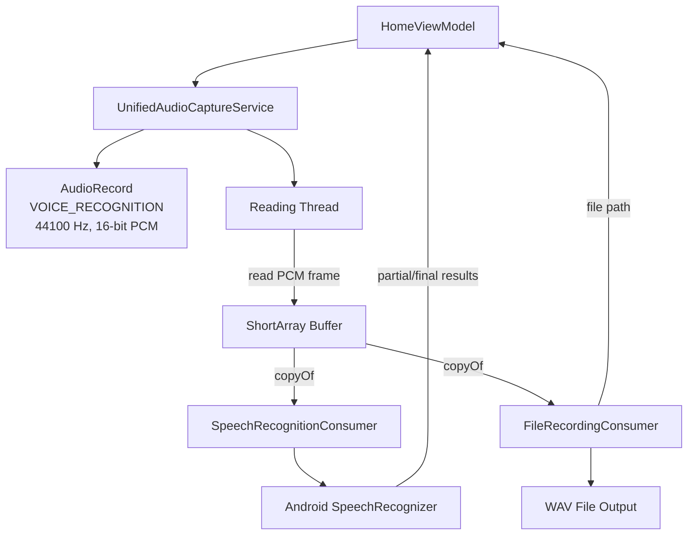
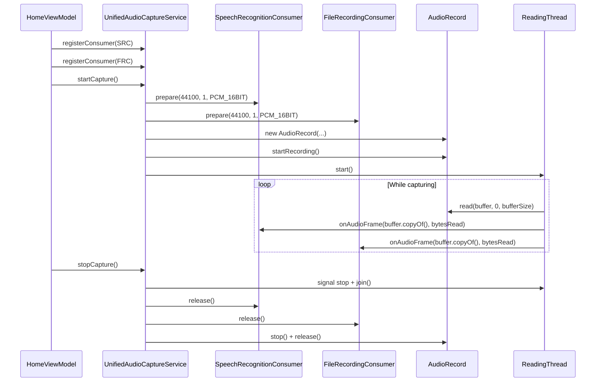

# Design Document: Unified Audio Capture

## Overview

The Unified Audio Capture feature replaces the current broken dual-service architecture where both `AudioRecorderService` and `SpeechRecognitionService` independently compete for the microphone via `AudioSource.VOICE_RECOGNITION`. Since Android's `AudioRecord` permits only a single consumer at a time, the current approach causes one service to fail silently.

The new design introduces a **fan-out architecture**: a single `UnifiedAudioCaptureService` owns the `AudioRecord` instance, reads raw PCM data on a dedicated background thread, duplicates each frame, and dispatches independent copies to registered consumers via a common `AudioConsumer` interface. This guarantees both speech recognition and file recording receive identical audio data without contention.

### Design Decisions

| Decision | Rationale |
|----------|-----------|
| Single `AudioRecord` owner | Android only allows one consumer per audio source; centralizing ownership eliminates contention |
| `ShortArray` frame copies per consumer | Prevents cross-consumer mutation; `ShortArray.copyOf()` is cheap for typical buffer sizes (2048–4096 samples) |
| Dedicated reading thread (not coroutine) | `AudioRecord.read()` is a blocking JNI call; a plain thread avoids coroutine dispatcher starvation |
| Consumer interface with `prepare`/`release` lifecycle | Allows consumers to allocate/free resources in sync with capture lifecycle without coupling to `AudioRecord` internals |
| WAV output format for file recording | WAV is lossless, requires no codec initialization, and can be written incrementally (header patched on finalize) |

## Architecture



### Lifecycle Flow



## Components and Interfaces

### AudioConsumer Interface

```kotlin
package com.transcribecare.app.service

/**
 * Interface for components that consume raw PCM audio frames
 * from the UnifiedAudioCaptureService.
 */
interface AudioConsumer {
    /**
     * Called once before capture begins. Consumers should allocate
     * resources and configure themselves for the given audio format.
     */
    fun prepare(sampleRate: Int, channelCount: Int, encoding: Int)

    /**
     * Called for each PCM frame read from AudioRecord.
     * Each consumer receives its own independent copy of the frame.
     *
     * @param frame ShortArray containing PCM samples (independent copy)
     * @param frameSize Number of valid samples in the frame
     */
    fun onAudioFrame(frame: ShortArray, frameSize: Int)

    /**
     * Called when capture ends. Consumers should finalize and free resources.
     */
    fun release()
}
```

### UnifiedAudioCaptureService

```kotlin
package com.transcribecare.app.service

/**
 * Central audio capture service that owns the AudioRecord instance,
 * reads PCM data on a background thread, and dispatches frame copies
 * to registered AudioConsumer instances.
 */
class UnifiedAudioCaptureService(
    private val onError: (message: String) -> Unit
) {
    private val consumers = mutableListOf<AudioConsumer>()
    private var audioRecord: AudioRecord? = null
    private var readingThread: Thread? = null
    private var isCapturing: Boolean = false
    private var buffer: ShortArray? = null

    fun registerConsumer(consumer: AudioConsumer)
    fun startCapture()
    fun stopCapture()
    fun destroy()
}
```

**Key behaviors:**
- `registerConsumer()` — adds a consumer to the dispatch list (must be called before `startCapture()`)
- `startCapture()` — validates consumers exist, creates `AudioRecord`, calls `prepare()` on each consumer, spawns reading thread
- `stopCapture()` — signals thread to stop, joins thread, calls `release()` on consumers, releases `AudioRecord`
- `destroy()` — stops capture if active, clears consumer list

### SpeechRecognitionConsumer

```kotlin
package com.transcribecare.app.service

/**
 * AudioConsumer that feeds raw PCM frames to Android's SpeechRecognizer
 * for continuous speech-to-text transcription.
 */
class SpeechRecognitionConsumer(
    private val context: Context,
    private val onPartialResult: (interimText: String) -> Unit,
    private val onFinalResult: (text: String) -> Unit,
    private val onError: (message: String) -> Unit
) : AudioConsumer {
    override fun prepare(sampleRate: Int, channelCount: Int, encoding: Int)
    override fun onAudioFrame(frame: ShortArray, frameSize: Int)
    override fun release()
}
```

**Key behaviors:**
- Wraps Android's `SpeechRecognizer` to accept raw PCM input
- Auto-restarts recognition sessions on silence timeout to maintain continuous transcription
- Propagates partial/final results and errors via callbacks

### FileRecordingConsumer

```kotlin
package com.transcribecare.app.service

/**
 * AudioConsumer that encodes raw PCM frames into a WAV file
 * for later playback.
 */
class FileRecordingConsumer(
    private val context: Context,
    private val onError: (message: String) -> Unit
) : AudioConsumer {
    private var outputFilePath: String? = null

    override fun prepare(sampleRate: Int, channelCount: Int, encoding: Int)
    override fun onAudioFrame(frame: ShortArray, frameSize: Int)
    override fun release()
    fun getOutputFilePath(): String?
}
```

**Key behaviors:**
- Creates a timestamped WAV file in the app's recordings directory on `prepare()`
- Writes PCM data incrementally on each `onAudioFrame()` call
- Patches the WAV header with final data size on `release()`
- Checks available storage (≥10 MB) before creating the file
- Exposes file path for session association

### Updated HomeViewModel Integration

The `HomeViewModel` replaces direct `SpeechRecognitionService` and `AudioRecorderService` usage with `UnifiedAudioCaptureService` orchestration:

```kotlin
// Before (broken — two services competing for mic)
private var speechRecognitionService: SpeechRecognitionService? = null
private var audioRecorderService: AudioRecorderService? = null

// After (unified — single mic owner with fan-out)
private var captureService: UnifiedAudioCaptureService? = null
private var speechConsumer: SpeechRecognitionConsumer? = null
private var fileConsumer: FileRecordingConsumer? = null
```

## Data Models

### Audio Configuration Constants

```kotlin
object AudioConfig {
    const val SAMPLE_RATE = 44100
    const val CHANNEL_CONFIG = AudioFormat.CHANNEL_IN_MONO
    const val CHANNEL_COUNT = 1
    const val AUDIO_FORMAT = AudioFormat.ENCODING_PCM_16BIT
    const val AUDIO_SOURCE = MediaRecorder.AudioSource.VOICE_RECOGNITION
    const val MIN_STORAGE_BYTES = 10L * 1024 * 1024 // 10 MB
}
```

### WAV File Header Structure

```kotlin
/**
 * WAV file header for PCM audio.
 * Written at file creation with placeholder data size,
 * patched on release() with actual byte count.
 */
data class WavHeader(
    val sampleRate: Int = 44100,
    val channelCount: Int = 1,
    val bitsPerSample: Int = 16,
    val dataSize: Int = 0  // Patched on finalize
) {
    val byteRate: Int = sampleRate * channelCount * bitsPerSample / 8
    val blockAlign: Int = channelCount * bitsPerSample / 8
    val headerSize: Int = 44
}
```

### Capture State

```kotlin
enum class CaptureState {
    IDLE,       // No AudioRecord, no thread
    CAPTURING,  // AudioRecord active, thread reading
    STOPPING    // Thread signaled to stop, awaiting join
}
```

### Frame Duplication Model

The core duplication logic is a pure function suitable for property-based testing:

```kotlin
/**
 * Creates independent copies of a PCM frame for each consumer.
 *
 * @param frame The original frame read from AudioRecord
 * @param frameSize Number of valid samples in the frame
 * @param consumerCount Number of registered consumers
 * @return List of independent ShortArray copies, one per consumer
 */
fun duplicateFrame(frame: ShortArray, frameSize: Int, consumerCount: Int): List<ShortArray> {
    return (0 until consumerCount).map { frame.copyOf(frameSize) }
}
```

## Correctness Properties

*A property is a characteristic or behavior that should hold true across all valid executions of a system — essentially, a formal statement about what the system should do. Properties serve as the bridge between human-readable specifications and machine-verifiable correctness guarantees.*

### Property 1: Frame Dispatch Completeness

*For any* PCM frame of arbitrary content and size, and *for any* set of N registered consumers (N ≥ 1), dispatching the frame SHALL result in exactly N copies being produced — one delivered to each consumer.

**Validates: Requirements 3.1, 3.2**

### Property 2: Copy Independence

*For any* PCM frame of arbitrary content, when the frame is duplicated and dispatched to two or more consumers, modifying any sample in one consumer's copy SHALL NOT alter any sample in any other consumer's copy.

**Validates: Requirements 9.1, 9.2**

### Property 3: Content Preservation

*For any* PCM frame of arbitrary content and size, each copied array dispatched to a consumer SHALL contain values identical to the corresponding values in the original frame (i.e., `copy[i] == original[i]` for all valid indices).

**Validates: Requirements 9.3**

## Error Handling

| Scenario | Component | Behavior |
|----------|-----------|----------|
| `AudioRecord` init fails | UnifiedAudioCaptureService | Invoke `onError`, remain in IDLE state |
| `AudioRecord.read()` returns error code | UnifiedAudioCaptureService | Invoke `onError`, stop capture, release resources |
| No consumers registered at `startCapture()` | UnifiedAudioCaptureService | Invoke `onError`, remain in IDLE state |
| Speech recognizer error | SpeechRecognitionConsumer | Invoke `onError` callback, attempt restart if recoverable |
| File write failure | FileRecordingConsumer | Invoke `onError` callback with descriptive message |
| Insufficient storage (<10 MB) | FileRecordingConsumer | Invoke `onError` on `prepare()`, do not create file |
| `destroy()` called during active capture | UnifiedAudioCaptureService | Stop capture first (thread join), then release all resources |
| Thread interrupted during read | UnifiedAudioCaptureService | Exit read loop cleanly, proceed with normal shutdown |

### Error Propagation Strategy

Errors from consumers are propagated to the `HomeViewModel` via the `onError` callback passed at construction time. The ViewModel exposes errors through `StateFlow<String?>` for UI display. Consumer errors do not automatically stop capture — the ViewModel decides whether to stop based on error severity.

## Testing Strategy

### Unit Tests (JUnit 4)

- **UnifiedAudioCaptureService lifecycle**: Verify state transitions (IDLE → CAPTURING → STOPPING → IDLE)
- **Error scenarios**: Init failure, read error, no consumers, destroy during capture
- **Consumer registration**: Verify consumers are accepted before capture, rejected during capture
- **HomeViewModel integration**: Verify correct orchestration sequence with mocked service
- **FileRecordingConsumer**: WAV header generation, storage check, file path exposure
- **SpeechRecognitionConsumer**: Callback propagation, auto-restart behavior

### Property-Based Tests (Kotest)

Property-based tests validate the frame duplication logic — the core pure function that ensures correctness of the fan-out architecture.

- **Library**: Kotest Property (`io.kotest:kotest-property:5.8.0`)
- **Minimum iterations**: 100 per property
- **Tag format**: `Feature: unified-audio-capture, Property {N}: {title}`

Each correctness property maps to a single property-based test:

| Property | Test Description | Generator Strategy |
|----------|-----------------|-------------------|
| Property 1: Frame Dispatch Completeness | Generate random ShortArrays (size 1–8192) and consumer counts (1–10), verify output list size equals consumer count | `Arb.shortArray(Arb.int(1..8192))`, `Arb.int(1..10)` |
| Property 2: Copy Independence | Generate random ShortArrays, duplicate for 2+ consumers, mutate one copy, verify others unchanged | `Arb.shortArray(Arb.int(1..4096))`, mutation at random index |
| Property 3: Content Preservation | Generate random ShortArrays, duplicate, verify each copy is value-equal to original | `Arb.shortArray(Arb.int(1..8192))` |

### Integration Tests

- **End-to-end capture flow**: Start capture → dispatch frames → stop capture (with mocked AudioRecord)
- **Thread safety**: Verify no race conditions between stop signal and frame dispatch
- **Resource cleanup**: Verify AudioRecord and consumers are released in correct order
